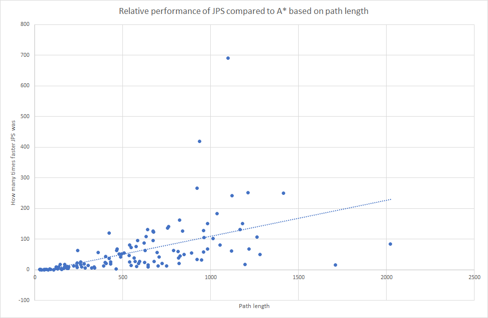
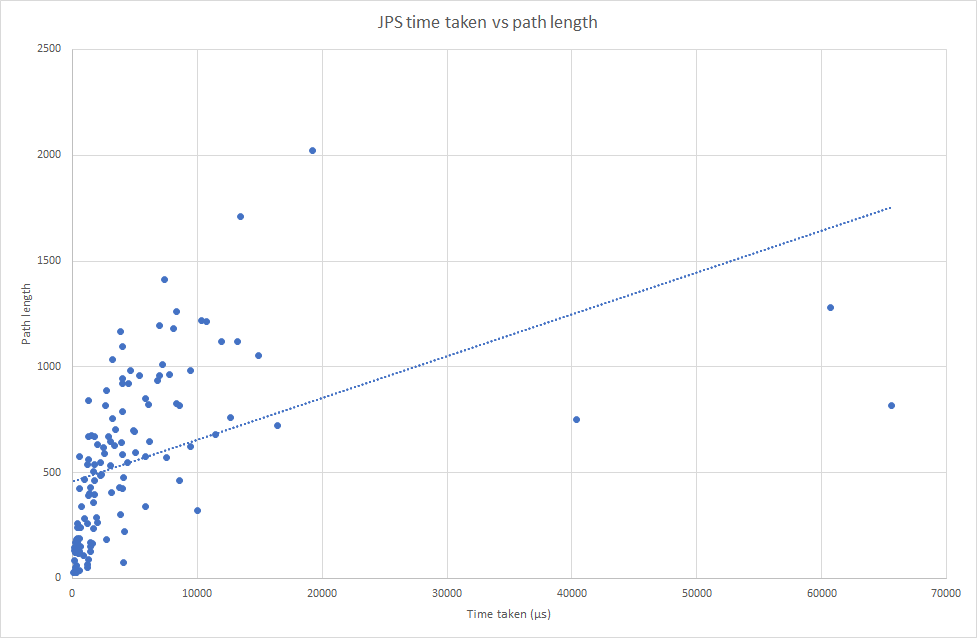
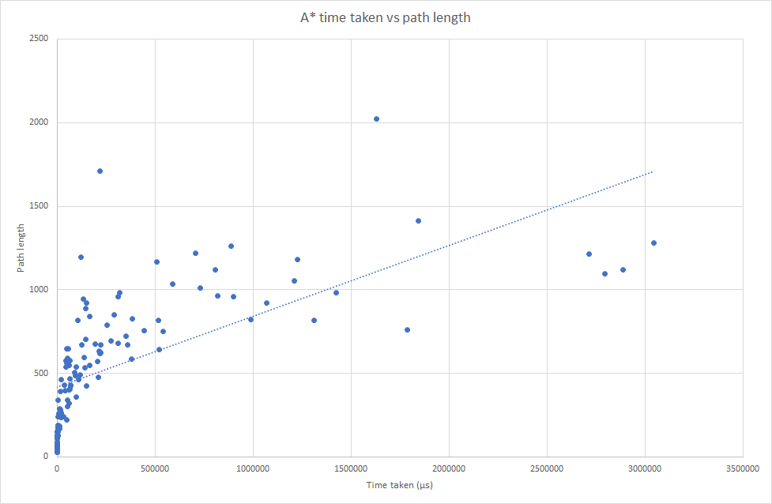

# Implementation document
### Project structure
The project is mainly split into the GUI and pathing parts. 

The GUI part houses everything related to showing the progress of the pathing to the user, it mostly stays confined in its own part and doesn't fiddle that much with the pathing part. 

The pathing part has its own representation of the map that it's solving and will very frequently ask the GUI to draw its progress for the user. Pathing is run on its own thread such that the GUI can be updated while the algorithm is solving the map.

### Implemented time and space complexities
A\* works exactly as it should based on visual inspection, so its time complexity is what it's supposed to be. It uses a priority queue such that the nodes closest to the goal via Euclidean distance is handled first. 

Since JPS is an extension of A\* per se, its time complexity is similar to A\* as choosing which node will be handled next is decided the exact same way as in A\*. When there is very little symmetry, JPS cannot utilize graph pruning that much so its worst performance is in the same class as A\*. Despite this, even though JPS has a similar complexity, it can "skip" a very large amount of nodes that would otherwise be handled by A\* and this is why it ends up being so much faster.

As for space complexity, both the algorithms keep all nodes in memory, and thus have a similar space complexity in the worst case. Due to the aforementioned graph pruning, though, JPS will perform better when there is a lot of empty space, as it can skip unnecessary nodes without saving them in memory.

### Comparative performance
A\* works pretty fast, it can solve a very complex 1000x1000 labyrinth in a couple of seconds.
Based on empirical testing in the performance tests outlined in the testing document, JPS has never been slower than A\*. At worst, JPS is still at least a couple times faster and at best more than a hundred times faster. As we can see from graph 1, JPS becomes faster and faster than A\* for bigger inputs.

### Possible flaws and improvements
- 

### Sources
For A\* I mostly got by with the help of its [Wikipedia article](https://en.wikipedia.org/wiki/A*_search_algorithm)

List for sources used for JPS development:
- http://users.cecs.anu.edu.au/~dharabor/data/papers/harabor-grastien-aaai11.pdf
- https://www.gamedev.net/tutorials/programming/artificial-intelligence/jump-point-search-fast-a-pathfinding-for-uniform-cost-grids-r4220/
- https://www.utupub.fi/bitstream/handle/10024/148054/DI_tyo_Pertti_Ranttila_final.pdf
- https://zerowidth.com/2013/a-visual-explanation-of-jump-point-search.html